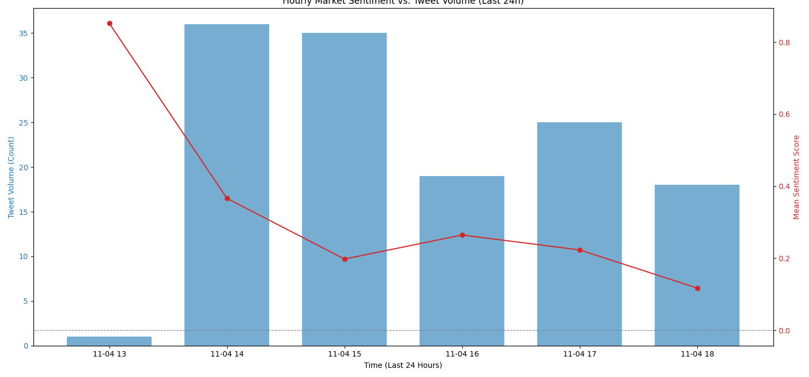

#  XMarket-Intelligence

A data collection and analysis system for **real-time market intelligence** built using **Python** and **Selenium**.
This project focuses on extracting and analyzing discussions around the Indian stock market from **Twitter/X**, without using any paid APIs.

---

##  Overview

This system automates the end-to-end workflow — from data scraping and cleaning to signal generation and visualization — using only open-source tools.
It efficiently handles authentication, rate-limiting, and data normalization to produce actionable insights suitable for quantitative or sentiment-based trading research.

---

##  Key Features

- **Selenium-Based Scraper:** Uses a live Chrome/Brave browser session for authentic, real-time tweet collection.
- **Cookie-Based Authentication:** Bypasses API restrictions by reusing a logged-in session stored in `cookies.json`.
- **Dynamic Rate Limiting:** Randomized delays (`2.5–4.5s`) between scrolls to mimic human behavior.
- **Data Deduplication:** Avoids storing duplicate tweets using unique tweet IDs.
- **Efficient Storage:** Saves cleaned data in compressed `Parquet` format for fast loading and memory efficiency.
- **Signal Generation:** Converts text into sentiment and engagement-based indicators.
- **Scalability Notes:** Includes clear guidance for scaling to 10× more data using Selenium Grid or distributed frameworks.

---

##  System Architecture

X.com (Twitter) <br>
↓ <br>
Selenium WebDriver <br>
↓ <br>
Raw Tweets (JSON) <br>
↓ <br>
Processing & Normalization (Pandas) <br>
↓ <br>
Clean Dataset (Parquet) <br>
↓ <br>
Sentiment + Engagement Analysis <br>
↓ <br>
Signals Visualization (Matplotlib)

---




##  Setup Instructions

```bash
1️) Clone the Repository
    git clone https://github.com/your-username/xmarket-intelligence.git
    cd xmarket-intelligence

2️) Prepare Session Cookies
    Log in to https://x.com in your Chrome or Brave browser.
    Open in inspect Mode -> Click on Application
    OR
    Use the Cookie-Editor extension to export all cookies for the x.com domain as a JSON file.
    Save it as cookies.json in the project’s root directory.

    Example json:

        [
        {
        "domain": ".x.com",
        "expirationDate": 1844514452,
        "hostOnly": false,
        "httpOnly": true,
        "name": "auth_token",
        "path": "/",
        "sameSite": "Lax",
        "secure": true,
        "value": "your_auth_token"
        },
        {
        "domain": ".x.com",
        "expirationDate": 1844514452,
        "hostOnly": false,
        "httpOnly": false,
        "name": "ct0",
        "path": "/",
        "sameSite": "Lax",
        "secure": true,
        "value": "your_ct0_value"
        }
    ]


3) Security Tip:
    Add cookies.json to .gitignore to avoid committing session tokens.
    echo "cookies.json" >> .gitignore

4) Set Up Virtual Environment
    python -m venv venv
    source venv/bin/activate    # On Windows: venv\Scripts\activate

5) Install Dependencies
    pip install -r requirements.txt

6) Configure Browser Path (Optional)
    In src/scraper.py, update the brave_path(with browser executable location) if you’re using Other Browser:

        brave_path = "/usr/bin/google-chrome"

7) Run the Full Pipeline
    python -m src.main

- Output Files
───────────────────────────────────────────────────────────────
    tweets.parquet        → Processed tweet dataset in columnar format
    signals_analysis.png  → Visualization of aggregated sentiment & tweet volume


- Example Insights
───────────────────────────────────────────────────────────────
    • Sentiment distribution across hashtags (#nifty50, #banknifty, etc.)
    • Volume spikes correlated with market events
    • Engagement-weighted sentiment trends
    • Top influencers and most engaged posts

- Scalability & Optimization
───────────────────────────────────────────────────────────────
    • Parallel Scraping → Selenium Grid / Dockerized workers
    • Proxy Rotation → Rotate IPs to avoid anti-bot restrictions
    • Distributed Processing → Move from Pandas → Dask/Spark
    • Streaming Ingestion → Headless, continuous scraping design

- Tech Stack
───────────────────────────────────────────────────────────────
    Language: Python 3.10+
    Web Scraping: Selenium, WebDriver Manager
    Data Processing: Pandas, PyArrow
    Storage: Parquet
    Analysis: NLTK (VADER), TF-IDF
    Visualization: Matplotlib
    Browser: Chrome / Brave

- License
───────────────────────────────────────────────────────────────
    This project is released under the MIT License by Aamir Sheikh.
